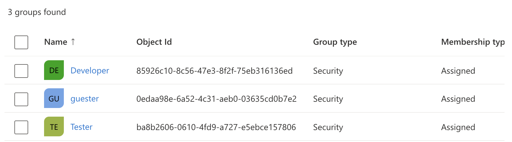
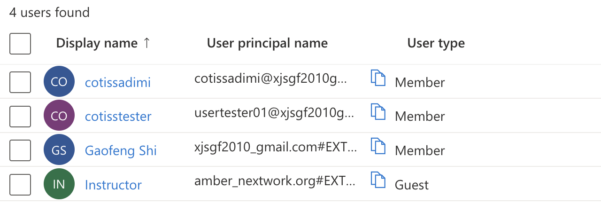

# Nextwork Azure SummerProject
## The Honest Feedback project. 
This project is Azure study project for Cotiss company originased by NextWork summer of Azure 2022. The project required a couple of steps to build a simple website on Azure cloud. 
The website called The Honest-Feedback is to collectiong feedback from the employees. \
There are four basic goals:
1. Account goal:
   - IAM for the project.
   - MFA for the project. 
   - Billing alerts of this project.
2. Web Hosting: 
   - Deploy a VM host simple static "Honest-Feedback Coming Soon" web page. 
   - Apply snapshot of VM to deploy a new VM. 
3. Auto Scaling:
   - Set an Azure Load Balancer for the VMs with two availability Zone. 
4. External Data:
   - use Azure Cosmos DB table to loading and retrieveing data on the website. 

Finaly, we built two verstion website:
   - Node.js web with NoSQL Azure Cosmos DB deployed on Linux virtual machine. 
   - Node.js web with NoSQL Azure Cosmos DB deployed on Azure App Service. 
   
   
### The Azure project Account setting
The Azure account setting for this project is based on a free trial.  We need to consider the cost so often. 
The account subscription access control  setting in Azure Active Directory.\
There are three Groups:
   - Developer: the administrator with contrivuter role and the developer. 
   - Tester: the website tester
   - Guest.
   //
      

There four users:
   - Gaofeng Shi: the owner of the account. 
   - Cotissadmi: is the website developer and administrator with a contributor role in the developer group.
   - Cotissterster: is the website tester in the tester group.
   - Instructor: assigned to Nextwork Amber as a guest role with full access to the project in the guest group. 
   

### The VM backup deploy

### Load Balance and Auto scaling

### Azure Cosmos DB for data

### The final website deploy
 

