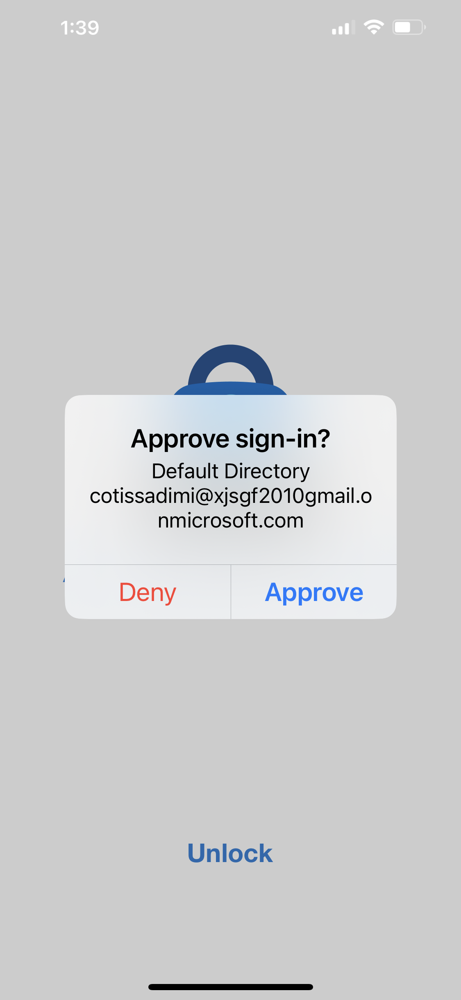
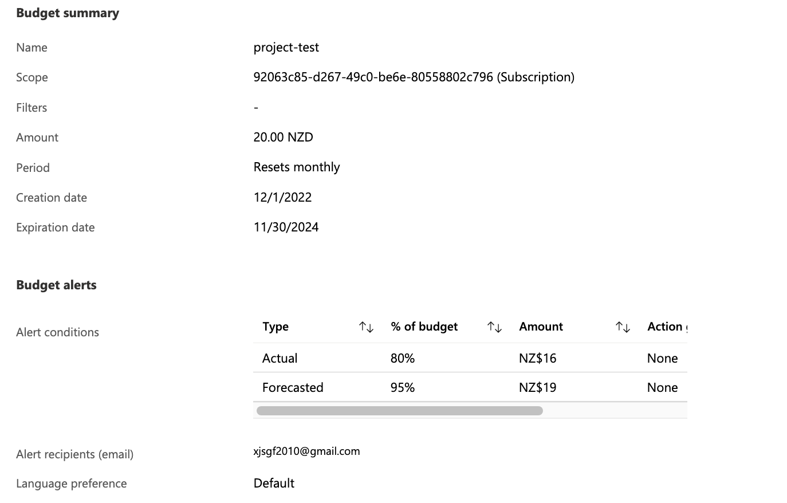
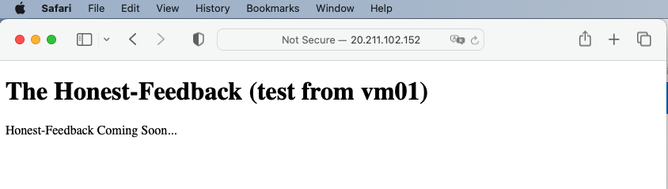
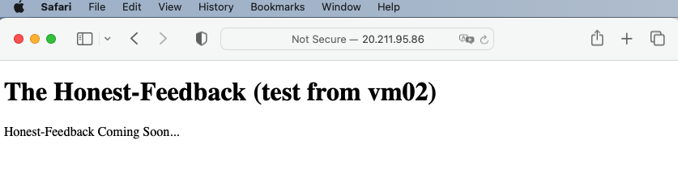
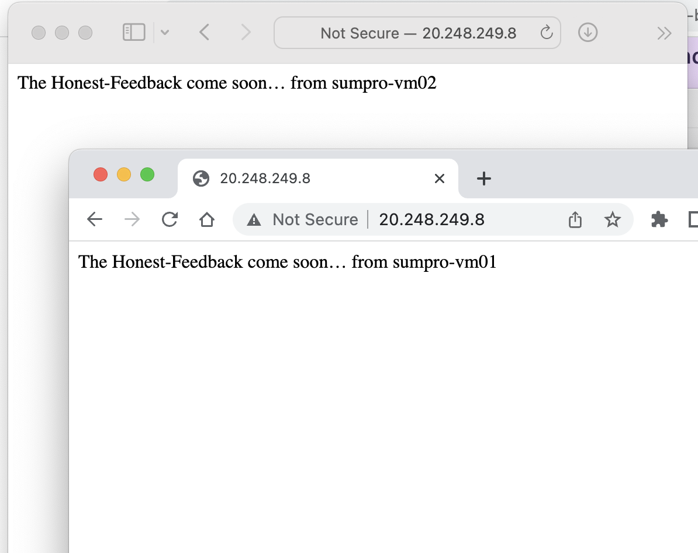
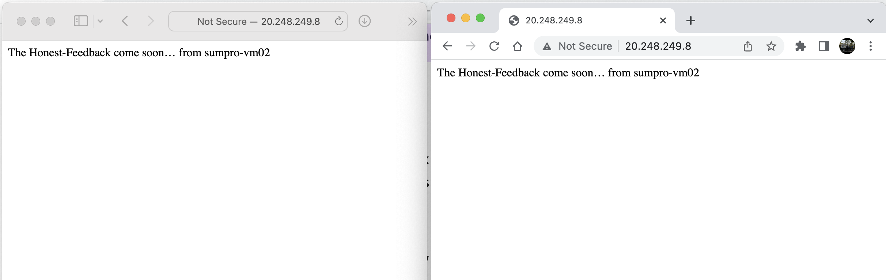
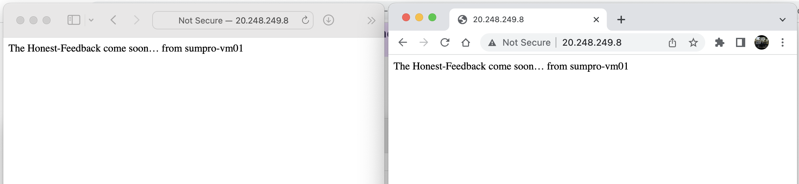
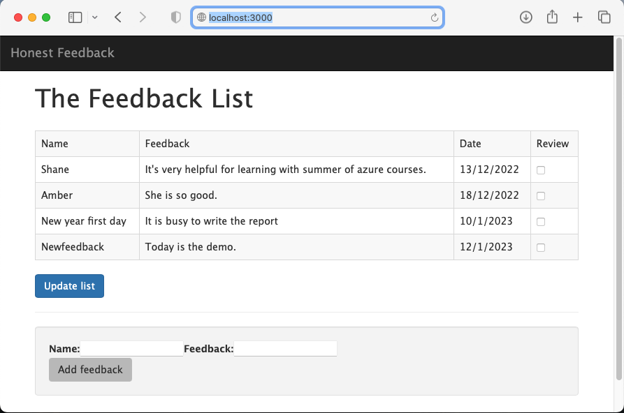

# Nextwork Azure Summer Project
## The Honest Feedback project. 
This project is an Azure study project for Cotiss company organised by NextWork summer of Azure 2022. The project required a couple of steps to build a simple website on Azure cloud. 
The website called The Honest-Feedback is to collect feedback from the employees. \
There are four basic goals:
1. Account goal:
   - IAM for the project.
   - MFA for the project. 
   - Billing alerts of this project.
2. Web Hosting: 
   - Deploy a VM host simple static "Honest-Feedback Coming Soon" web page. 
   - Apply snapshot of VM to deploy a new VM. 
3. Auto Scaling:
   - Set an Azure Load Balancer for the VMs with two availability Zone. 
4. External Data:
   - use Azure Cosmos DB table to loading and retrieveing data on the website.<br/>

Finaly, we deployed two verstion website for [_The Honest Feedback_](https://github.com/gaofengShi/NextworkAzureSummerProject/tree/main/feedback):
   - Node.js web with NoSQL Azure Cosmos DB deployed on [Linux virtual machine](http://feedbackweb01.eastasia.cloudapp.azure.com:3000/). 
   - Node.js web with NoSQL Azure Cosmos DB deployed on [Azure App Service](https://feedbackweb02.azurewebsites.net).
   
   
### The Azure project Account setting
The Azure account setting for this project is based on a free trial.  We need to consider the cost so often. 
The account subscription access control  setting in Azure Active Directory.\
There are three Groups:
   - Developer: the administrator with contrivuter role and the developer. 
   - Tester: the project tester. 
   - Guest: the guester of the project.     
      

There are four users:
   - Gaofeng Shi: the owner of the account. 
   - Cotissadmi: is the website developer and administrator with a contributor role in the _Developer_ group.
   - Cotissterster: is the website tester in the _Tester_ group.
   - Instructor: assigned to Nextwork Amber as a guest role with full access to the project in the _guest_ group. 
      

MFA setting in Default Directory there are two types: __Security__ and __Microsoft 365__. \
This setting let the user passwordless login. If the user has the Microsoft 365 account, you can built-in with Azure account together. For example, The owner login the account with Microsoft 365 account. \
For the user who doesn't have the Microsoft 365 account. You should use the Multi-factor authentication with Microsoft Authenticator APP in your device. For instance, the Cotissadmi login the account with Microsoft Authenticator. So when you login it will show on your computer let you approve from your phone.  
   .
 
The budget control and billing alerts of this project assume the cost is $20.00 monthly. The 
Alert conditions setting that actual cost is 80% and forecasted cost is 95%. 

The picture below show the buget setting:\
   \
When the alert is triggered it will send an email to the owner. 

You also can use the cost analysis function in the subscription to analysis you spent and reduce it in future. 
The picure below is the screenshot of the project cost analysis:\
   
### The VM deploy and backup
The Virtual machine for host the webside properties:
   - VM Name: **cotissweb01** with Linux _Ubuntu20.04_ system
   - Size: Standard B1s (1 vcpu, 1 GiB memory) (eligible free for one year).  
   - OS disk: Resize to 64 Gib(P6) Free account eligible. Premium SSD (locally-redundant storage)
   - Public IP address is dynimic setting as it's free. We try setting on standard static when deploy load balance and scaling. 
   - DNS name: _sumprovm.australiaeast.cloudapp.azure.com_.  
   - Networking: need _Add inbound port rule_ for **Port** 3000 as we deploy _Node.js express_ web application. 
 
 After we deployed the web application into VM, we can backup the VM with snapshot and create a VM2 from the snapshot easily.\
 The below screenshots are the website display form VM2 and VM1. (for the cost reason we deleted the disk of snapshot after demostration). \
     
    
### Load Balance and Auto scaling
The virtual machine is set for a web server in this project. We set and test the load balance based on two VMs and a virtual network. Here we need to follow three steps to create a public load balancer:
   - Create the virtual network: _sumpro-costiss-vn_, subnet, and Azure Basion host. The virtual network and subnet contains the load balancer and virtual machines. The Bastion host is used to securely manage the virtual machines and install IIS to test the load balancer.
   - Create load balancer: it is a zone redundant load balancer can balances VMs with zone-redundancy or data path survives and region remains healthy.
   - NAT gateway: for outbound internet access for VMs. So we can test the load balance when we stop one of VMs.
   - Install IIS: set the IIS (internet information services) in the two VMs Basion connect. 

After all the setup, we test the web can be displayed form the two different VMs:\
   \
   As we can see the same IP displayed different contents.
   
If we showdown VM1, the two webs will display only from VM02:\
   
   
If we showdown VM2, the two webs will display only from VM01:
   
   
However, as we are in free trial, the load balancer and VM2 were deleted after the test. 
   
 
The version 2 website is deplyed on PaaS stracture Azure web Service. It is easily to scale up by change the App Service plan. The App Service plan is **Free F1** for the _Feedback_ simple website at moment. If the requirments grow up, it can be changed by increase the CPU, Memory, and Auto Scale from Hardware and  Feature views. 
### Azure Cosmos DB for data
The Azure Cosmos DB is created from Azure portal. The following steps show below: 
   - Select API option to create _NoSQL Recommend_ new Azure Cosmos DB.
   - Set the name : **sumpro-db** the unique name for the project. 
   - Location set same or close to the VM. 
   - Capacity mode is provisioned with free tier. 
 
 After the Azure cosmos DB success created, Go to the DB page and select **Keys**. Copy the values from _URL_ and _PRIMARY KEY_ to use in the web application. 
 
### Build a web application in local computer
This process you can see the reference link to how to develop a Node.js application.
The web application is [_The Honest Feedback_](https://github.com/gaofengShi/NextworkAzureSummerProject/tree/main/feedback). Make sure the **Keys** from the Azure cosmos DB set in the file _config.js_ correctly. 

You can download from here to your local computer. We need test it on our local computer before we deploy on Azure Cloud. Open a _Termainal_ on our local application folder. Start our server in local:
```
~/feedback % npm start
```
You will see output on your terminal that means the server start in local:
```
> feedback@0.0.0 start
> node ./bin/www
```
Open the browser with http://localhost:3000, you will see:
    


### The final website deploy
 
## Reference
- [Create a public load balancer on VMs](https://learn.microsoft.com/en-us/azure/load-balancer/quickstart-load-balancer-standard-public-portal?ns-enrollment-type=Collection&ns-enrollment-id=g76wc40dqxmjxq).
- [Build a Node.js web app with Azure cosmos DB in Azure app Service](https://learn.microsoft.com/en-us/azure/cosmos-db/nosql/tutorial-nodejs-web-app?ns-enrollment-type=Collection&ns-enrollment-id=g76wc40dqxmjxq).
